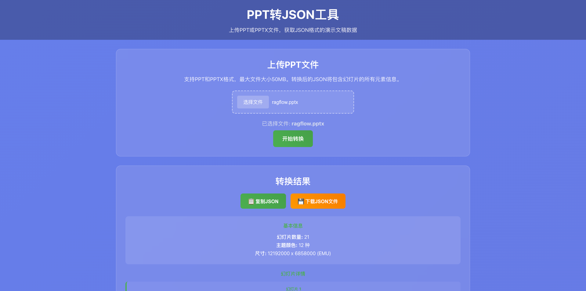

# PPT转JSON工具

一个功能强大的Web应用，可以将PowerPoint文件（PPT/PPTX）转换为结构化的JSON格式，同时提供Web界面和API接口。



## 功能特性

### 支持的PPT元素类型

- **文字元素** (`type: 'text'`)
  - 位置、尺寸、旋转角度
  - 边框样式（颜色、宽度、类型）
  - 填充（颜色、图片、渐变）
  - 阴影效果
  - 文本内容（HTML富文本）
  - 垂直对齐和文本方向

- **图片元素** (`type: 'image'`)
  - 位置、尺寸、旋转角度
  - 边框样式
  - 裁剪形状和范围
  - 图片地址（base64编码）

- **形状元素** (`type: 'shape'`)
  - 位置、尺寸、旋转角度
  - 边框和填充样式
  - 形状类型和路径
  - 文本内容

- **表格元素** (`type: 'table'`)
  - 位置、尺寸
  - 表格数据
  - 行高和列宽
  - 边框样式

- **图表元素** (`type: 'chart'`)
  - 位置、尺寸
  - 图表类型和数据
  - 主题色和样式

- **视频元素** (`type: 'video'`)
  - 位置、尺寸
  - 视频文件（blob格式）

- **音频元素** (`type: 'audio'`)
  - 位置、尺寸
  - 音频文件（blob格式）

- **公式元素** (`type: 'math'`)
  - 位置、尺寸
  - LaTeX表达式
  - 公式图片

- **Smart图元素** (`type: 'diagram'`)
  - 位置、尺寸
  - 子元素集合

- **组合元素** (`type: 'group'`)
  - 位置、尺寸
  - 子元素集合

### 幻灯片信息

- 主题色 (`themeColors`)
- 幻灯片尺寸 (`size`)
- 幻灯片宽度和高度 (`width`, `height`)
- 页面背景填充
- 页面备注 (`note`)

## 技术栈

### 后端
- **Node.js** + **Express** - 服务器框架
- **Multer** - 文件上传处理
- **Adm-zip** - PPTX文件解压
- **xml2js** - XML解析
- **fs-extra** - 文件系统操作

### 前端
- **React** - 用户界面框架
- **Ant Design** - UI组件库
- **React Dropzone** - 文件拖拽上传
- **React JSON View** - JSON可视化
- **Axios** - HTTP客户端

## 安装和运行

### 1. 克隆项目
```bash
git clone <repository-url>
cd ppt2json
```

### 2. 安装依赖
```bash
# 安装后端依赖
npm install

# 安装前端依赖
npm run install-client
```

### 3. 运行应用

#### 开发模式
```bash
# 启动后端服务器（端口5000）
npm run dev

# 新开终端，启动前端开发服务器（端口3000）
npm run client
```

#### 生产模式
```bash
# 构建前端
npm run build

# 启动生产服务器
npm start
```

### 4. 访问应用
- Web界面：http://localhost:5000
- API接口：http://localhost:5000/api/convert

## API使用

### 转换PPT文件
```bash
POST /api/convert
Content-Type: multipart/form-data

# 请求参数
file: PPT文件（.ppt或.pptx格式）

# 响应格式
{
  "success": true,
  "data": {
    "themeColors": {...},
    "size": {...},
    "width": 9144000,
    "height": 6858000,
    "slides": [...]
  }
}
```

### 健康检查
```bash
GET /api/health

# 响应
{
  "status": "ok",
  "message": "PPT转JSON服务运行正常"
}
```

## 使用示例

### 使用curl上传文件
```bash
curl -X POST \
  http://localhost:5000/api/convert \
  -H 'Content-Type: multipart/form-data' \
  -F 'file=@/path/to/your/presentation.pptx'
```

### 使用JavaScript上传文件
```javascript
const formData = new FormData();
formData.append('file', fileInput.files[0]);

fetch('/api/convert', {
  method: 'POST',
  body: formData
})
.then(response => response.json())
.then(data => {
  if (data.success) {
    console.log('转换结果:', data.data);
  } else {
    console.error('转换失败:', data.error);
  }
});
```

## 项目结构

```
ppt2json/
├── server.js              # Express服务器入口
├── package.json           # 后端依赖配置
├── utils/
│   └── pptxParser.js      # PPT解析器
├── client/                # React前端应用
│   ├── package.json       # 前端依赖配置
│   ├── public/
│   │   └── index.html     # HTML模板
│   └── src/
│       ├── App.js         # 主应用组件
│       ├── App.css        # 应用样式
│       ├── index.js       # 应用入口
│       └── index.css      # 全局样式
├── uploads/               # 上传文件临时目录
├── temp/                  # 临时解压目录
└── README.md             # 项目说明
```

## 配置选项

### 环境变量
- `PORT` - 服务器端口（默认：5000）
- `NODE_ENV` - 运行环境（development/production）

### 文件大小限制
- 最大文件大小：50MB
- 支持格式：.ppt, .pptx

## 注意事项

1. **文件格式支持**：目前主要支持PPTX格式，PPT格式支持有限
2. **内存使用**：大文件处理时可能占用较多内存
3. **临时文件**：上传的文件会在处理完成后自动删除
4. **错误处理**：详细的错误信息会返回给客户端

## 贡献

欢迎提交Issue和Pull Request来改进这个项目。

## 许可证

MIT License 
